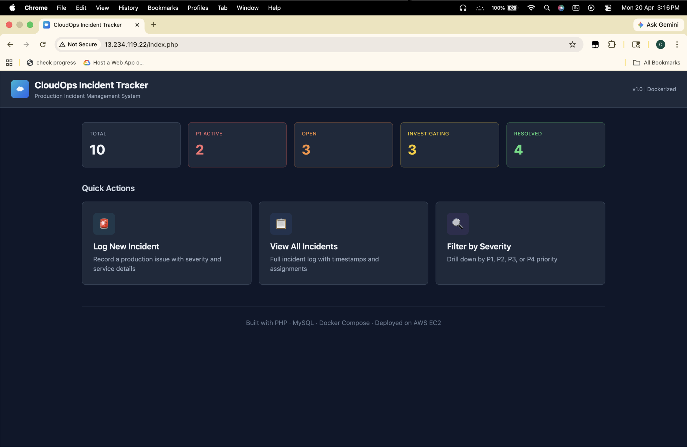
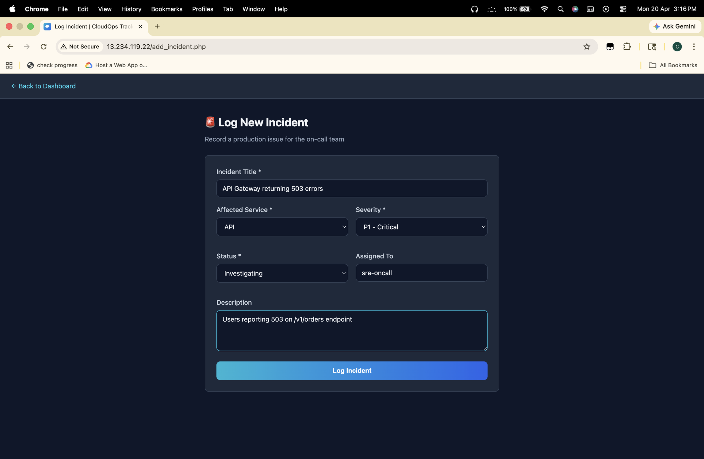
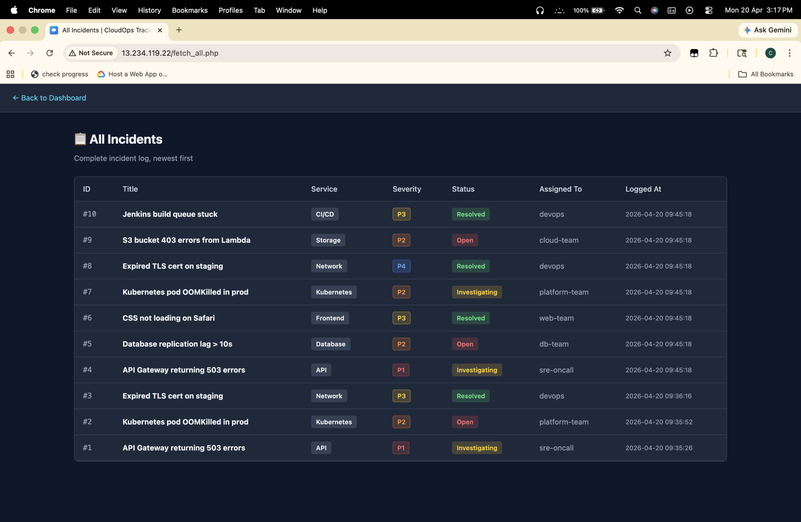
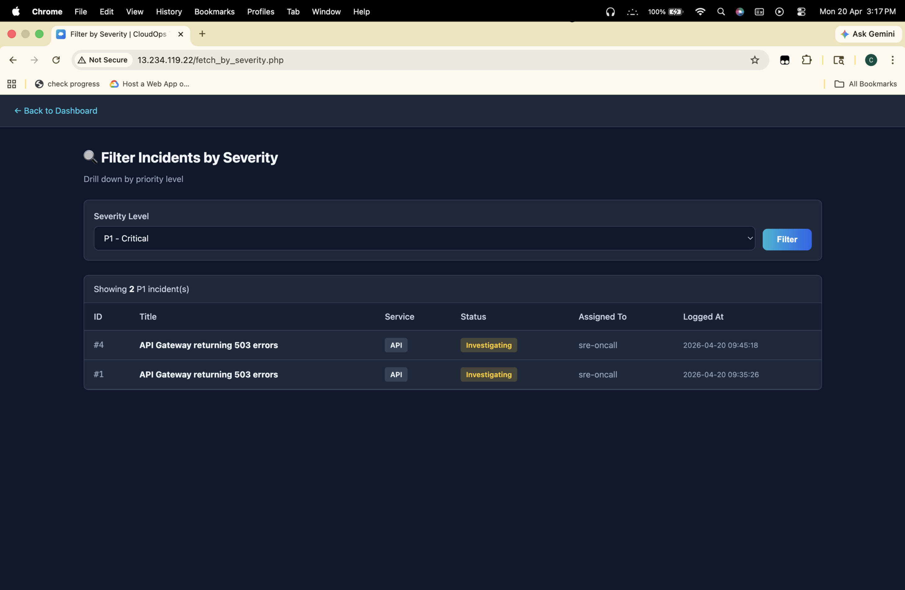

# CloudOps Incident Tracker

A containerized incident management system for DevOps / SRE teams to log, track, and filter production incidents by severity, service, and status. Built as a hands-on project to practice Docker Compose deployments on AWS EC2.

Think of it as a lightweight version of the kind of internal tooling every on-call engineer uses — PagerDuty / Jira Incident Management, but minimal.



## Features

- **Live dashboard** with real-time counts of total, P1 active, open, investigating, and resolved incidents
- **Log incidents** with title, affected service, severity (P1–P4), status, assignee, and description
- **Full incident log** with color-coded severity and status badges
- **Severity filter** to quickly drill down into P1 critical issues
- Persistent MySQL storage with auto-initialized schema
- Dark-themed UI, no external CDN dependencies

## Tech Stack

| Layer | Tech |
|-------|------|
| Frontend | Vanilla HTML + CSS (dark theme) |
| Backend | PHP 8.0 on Apache |
| Database | MySQL 8.0 |
| Orchestration | Docker Compose |
| Host | AWS EC2 (Ubuntu 22.04) |

## Architecture

```
┌─────────────────────────────────────────────┐
│           AWS EC2 (Ubuntu 22.04)            │
│                                             │
│   ┌──────────────┐      ┌──────────────┐     │
│   │     app      │ ───▶ │    mysql     │     │
│   │ PHP 8 +      │      │ MySQL 8.0    │     │
│   │ Apache       │      │              │     │
│   │ port 80      │      │ port 3306    │     │
│   └──────────────┘      └──────────────┘     │
│            │                                 │
│            └── Docker Bridge Network ────────│
└─────────────────────────────────────────────┘

                 ↓
     http://<EC2_PUBLIC_IP>
```

The app container connects to MySQL using Docker's internal DNS  
(service name `mysql` resolves to the DB container's IP).

A healthcheck on the MySQL container ensures the app only starts  
once the database is ready to accept connections.
## Project Structure

```
cloudops-tracker/
├── app/
│   ├── Dockerfile
│   ├── db.php                  # PDO connection with retry logic
│   ├── index.php               # Dashboard with live stats
│   ├── add_incident.php        # Log new incident form
│   ├── fetch_all.php           # View all incidents
│   ├── fetch_by_severity.php
│   ├── styles.css              # Local dark-theme styles
│   └── favicon.svg
│
├── mysql/
│   ├── Dockerfile
│   └── init.sql                # Schema bootstrap
│
├── screenshots/
│
├── docker-compose.yml
├── DEPLOYMENT.md               # Full EC2 deployment guide
├── LICENSE
└── README.md
```

## Quick Start (Local)

Requires Docker Desktop.

```bash
git clone https://github.com/satvik55/cloudops-tracker.git
cd cloudops-tracker
docker compose up -d
```

Open `http://localhost` in your browser.

To stop:
```bash
docker compose down
```

## Deployment on AWS EC2

Full step-by-step guide in [DEPLOYMENT.md](DEPLOYMENT.md).

## Screenshots

| Dashboard | Log Incident |
|-----------|--------------|
|  |  |

| All Incidents | Severity Filter |
|---------------|-----------------|
|  |  |

## What I Learned

- **Container orchestration with Docker Compose** — defining multi-service apps, internal networking, and using service names as DNS hostnames between containers
- **Race conditions in multi-container apps** — `depends_on` only guarantees start order, not readiness. Solved with a MySQL `healthcheck` plus application-level retry logic in `db.php`
- **AWS EC2 deployment flow** — security groups, SSH key management, `scp` for project transfer, Docker installation on Ubuntu via the official apt repository
- **Debugging production-style issues** — traced `getaddrinfo failed` errors to container startup timing; replaced a Tailwind CDN dependency with local CSS after seeing production warnings

## Future Improvements

- [ ] Add user authentication (login page, session management)
- [ ] Incident edit / resolve endpoints (currently create-only)
- [ ] Slack webhook notifications on new P1 incidents
- [ ] Dockerize with non-root users + read-only filesystems for production hardening
- [ ] CI/CD via GitHub Actions — build → push to Docker Hub → auto-deploy to EC2

## License

MIT — see [LICENSE](LICENSE).

---

Built by [Satvik Bodke](https://www.linkedin.com/in/satvik-bodke-b9a229194/) · [GitHub](https://github.com/satvik55)

> **Note:** This project was built as a portfolio exercise to practice Docker Compose deployments on AWS.
